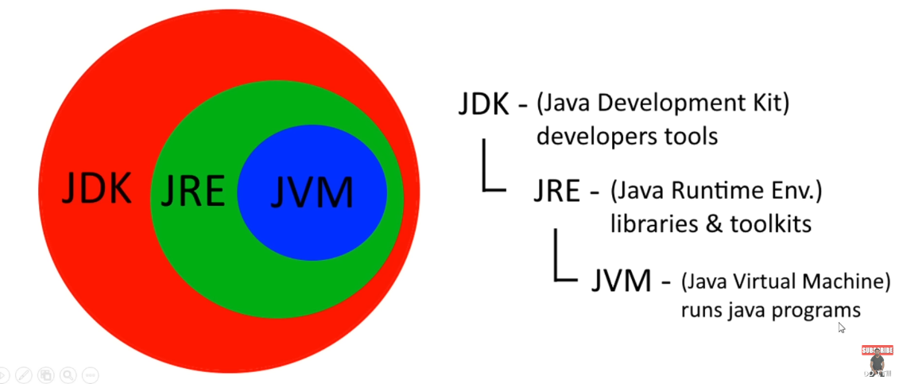
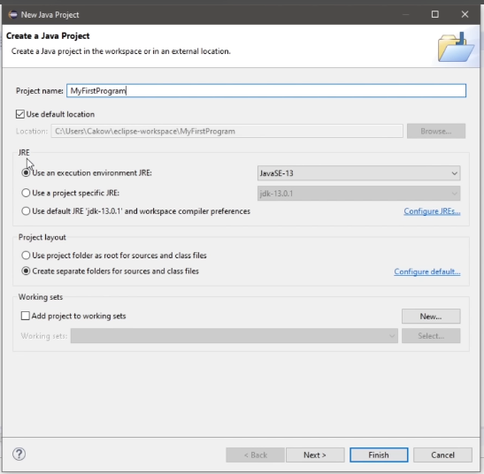
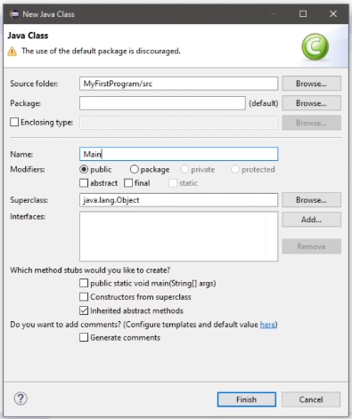
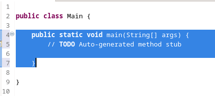
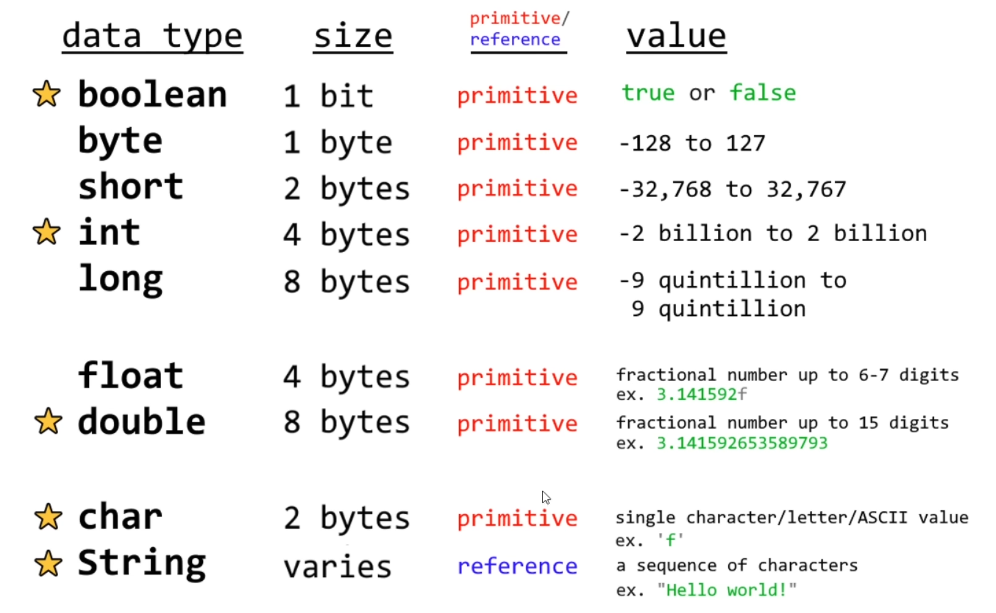
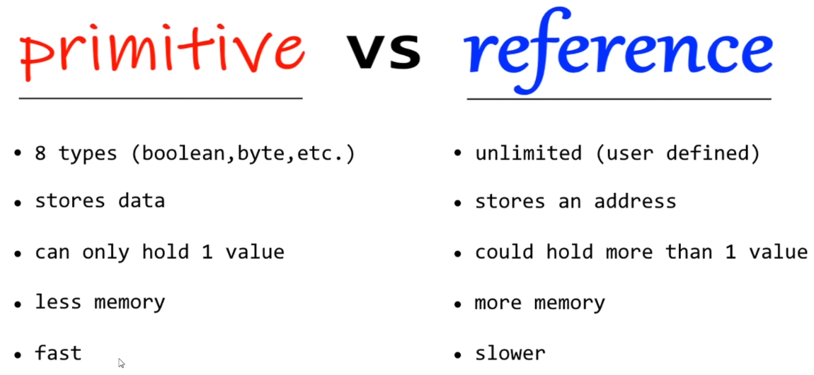
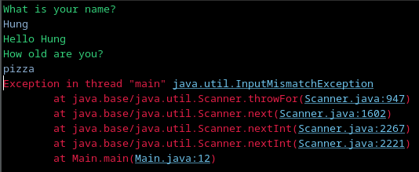

# Java
This is note from the Youtube video

<https://youtu.be/xk4_1vDrzzo?si=NTvuO5qAFNS4IWze>

## Basics

- `.java`: source code.

With compiler, we have byte code

- `.class`: byte code: cross-platform

With J.V.M we have object code

- object code (machine code)


JDK: Java development kit (developers tools)

-> JRE: Java Runtime Env (libraries and toolkits)

-> JVM: Java virtual machine (runs java program)




## Installation

Search for java JDK download, choose Java SE (Standard edition), Oracle JDK

IDE: Integrated Development Env

Recommend: Eclipse or IntelliJ IDEA

Here we install eclipse

Select workspace. Choose default.

Create new project, choose JRE 21
(in linux, the path is /usr/lib/jvm/...oracle21/)




Click of MyFirstProgram, choose new class. Name: Main, tick: public static void main(String[] args)




Everything in `Main` is wrapped inside `{}`. Inside a class Main, there is a method `main`



Without main, this program will not run. We have the tick box before to automatic add this part


Example:

```java
public class Main {

	public static void main(String[] args) {
		// TODO Auto-generated method stub
		System.out.print("Helloworld");
	}

}
```
Print in the console `Helloworld`.

**Note**: `System.out.print()` will not add a new line. To add a new line in the end, we use `System.out.println()`. Another way to add `\n` in the end to add new line

`\t`: add a tab space

If we use `System.out.print(""Hello"");`, it will show error, we have to backslash the quote
`System.out.print("\"Hello\"")`

`//`: single line comment

```java
`/*
* This
* is 
* a comment
*/`
```

: multiple line comment

Change dark theme:
Window- Preference - Appearance -Theme - Dark

Change console text color:
Window - Preference - Run/Debug - Console - Standard Out text color: Green
Background color slicely black

Shortcut: sysout then Ctrl+Space

Can use find and replace feature

Space note matter: `System.       out.print()` does not have error

Ctrl -/+ to zoom in/out

## Variables

8 primitive data types, with 4 important marked as star



Primitive vs reference



declaration: `int x;`; Assignment: `x = 123 ;`; initialization: `int x = 123;`

when assign long type, need capital L in the end
example `long x = 121421412341242134234L;`

float need to add `f` in the end.
double dont need `f` in the end

reference start with capital: String


## Swap two variables
easy. Add a temp variable

## Accept user input

using `Scanner`, need to import
`import java.util.Scanner;`

ex

```java
Scanner scanner = new Scanner(System.in);
System.out.println("What is your name?");
String name = scanner.nextLine();
System.out.println("Hello "+name);
```

Now, only accept integer input:
```java
Scanner scanner = new Scanner(System.in);
System.out.println("What is your name?");
String name = scanner.nextLine();
System.out.println("Hello "+name);

System.out.println("How old are you?");
int age = scanner.nextInt();
System.out.println("You are "+age+" years old");
```
When you type non integer, it cause errors: exception error



**Note:** `scanner.nextInt()` does not read the `\n` in the end of number. Hence, when you call `scanner.nextLine()`, it will only read `\n`. To make it normal, should use `scanner.nextLine()` right after `scanner.nextInt()` so that next time you read from user input, it read correctly.


## Arithmetics expression
with integer, if the result is float, it truncade the digits after dot.
```java
double x = 10;
x = (double) x/3;
```


## GUI intro
GUI: graphics user interface

`import javax.swing.JOptionPane;`

```java
String name = JOptionPane.showInputDialog("Enter your name");
JOptionPane.showMessageDialog(null,"Hello "+ name);
```

`JOptionPane.showInputDialog()` will return a string. To convert to int, need to use `Integer.parseInt`

```java
String name = JOptionPane.showInputDialog("Enter your name");
JOptionPane.showMessageDialog(null,"Hello "+ name);
int age = Integer.parseInt(JOptionPane.showInputDialog("Input your age"));
```


For double, use `double height = Double.parseDouble(JOptionPane.showInputDialog("Input your height"));`


```java
String name = JOptionPane.showInputDialog("Enter your name");
JOptionPane.showMessageDialog(null,"Hello "+ name);

int age = Integer.parseInt(JOptionPane.showInputDialog("Input your age"));
JOptionPane.showMessageDialog(null,"You are "+ age+" years old");


double height = Double.parseDouble(JOptionPane.showInputDialog("Input your height"));
JOptionPane.showMessageDialog(null, "Your height is "+height);
```

## Math class

`Math.min(x,y)`; `Math.max(x,y)`; `Math.sqrt(x)`;  `Math.round(x)`

`Math.floor(x)`;

`Math.ceil(x)`