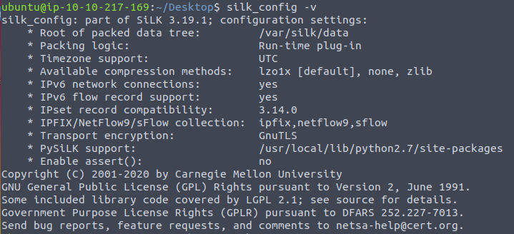
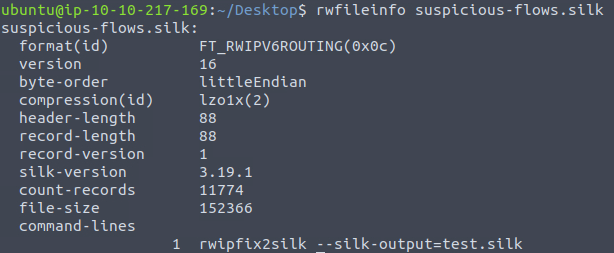
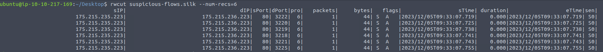
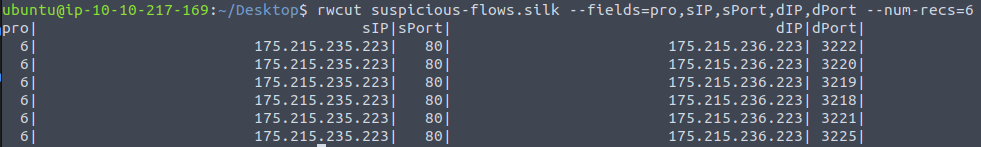
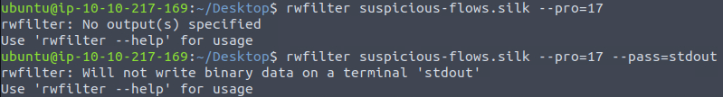
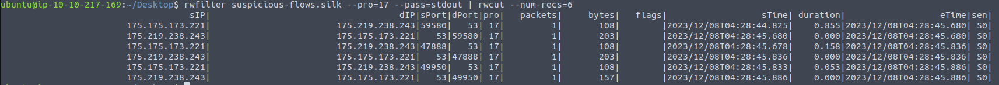

# Advent of cyber 2023

## Day16 - Machine learning: Can't CAPTCHA this machine!

### Convolutional Neural Networks

CNN have the ability to extract features that can be used to train a neural networks. In essence, CNNs are normal neural networks that simply have the feature-extraction process of the network itself.

Three main components:
- Feature extraction
- Fully connected layers
- Classification

Last two components was covered in previous tasks.

## Day17 - Traffic analysis: I Tawt | Taw A C2 Tat!

PCAPS formats are very useful for detailed analysis, but not practical for fast analysis with large data

NetFlow format provides only the summary of the traffic, does not contain the packet details and payload.

Key Data Files of PCAP format:
- Link layer information
- Timestamp
- Packet length
- MAC addresses
  - Source and destination MACs
- IP and port information
  - Source and destination IP addresses
  - Source and destination ports
- TCP/UDP information
- Application layer protocol **details**
- Packet data and payload

Key Data Fields of Network Flow format:

- IP and port information
  - Source and destination IP addresses
  - Source and destination ports
- IP protocol
- Volume details in byte and packet metrics
- TCP flags
- Time details
  - Start time
  - Duration
  - End time
- Sensor info
- Application layer protocol **information**

How to collect: can use wireshark. See module
<https://tryhackme.com/module/wireshark>


Convert PCAPs to network flows: SiLK (System for Internet Level Knowledge) - open-source tool, was developed by the CERT Situational Awareness group at Carnegie Mellon University's Software Engineering Institute.

SiLK suite has two parts: the packing system and the analysis suite. The packing system supports the collection of multiple network flow types (IPFIX, NetFlow v9, NetFlow v5) and stores them in binary files. The analysis suite contains the tools needed to carry out various operations (list, sort, count and statistics) on network flow records.


See the config and version
```bash
silk_config -v
```



Silk mainly works on a data repository. Default data repository is in `/var/silk/data` directory.


### See the info rwfileinfo
```bash
rwfileinfo FILENAME
```



### Reading rwcut
```bash
rwcut suspicious-flows.silk --num-recs=6
```



```bash
rwcut suspicious-flows.silk --fields=pro,sIP,sPort,dIP,dPort --num-recs=6
```




Some parameters
- Source IP: sIP
- Destination IP: dIP
- Source port: sPort
- Destination port: dPort
- Duration: duration
- Start time: sTime
- End time: eTime

Protocol number assigned by IANA (The internet Assigned Numbers Authority)
- ICMP = 1
- IPv4 = 4
- TCP = 6
- UDP = 17


### Filter rwfilter

rwfilter need to store in binary or pass to stdout then use rwcut



```bash
rwfilter suspicious-flows.silk --pro=17 --pass-stdout| rwcut --num-recs=6
```



### Statistic rwstats


## Day18 - Eradication: A gift that keep on giving

### top
```bash
top
```

use `q` to quit. Usually, we take memory dump of process to analyse it further before killing it, as killing it would cause us to lose that information. We assume that we have already done that and now we kill process

```bash
sudo kill <PID>
```

If we see the process again with different PID, it means that we successfully killed the process but it has been resurrected somehow.

Check the cronjobs, which are tasks that we ask the computer to perform on our behalf at a fixed interval. Often we can find traces of auto-starting processes.

run
```bash
crontab -l
```
There are not suspicious here.

```bash
sudo su
```
run with root then run `crontab -l` again. No new.

Check running services
```bash
systemctl list-unit-files | grep enabled
```

Check a specific service
```bash
systemctl status <service name>
```

Then we can see the info of the service and where it was loaded. No we stop it and remove it

```bash
sudo su
systemctl stop <service name>
systemctl status <service name>
systemctl disable <service name>
```
then go to folder and delete it
```bash
rm -rf /etc/systemd/<service name>
rm -rf /etc/systemd/system/service name
```

Check Linux Forensics room
<https://tryhackme.com/room/linuxforensics>


## test


hugo v0.121.1-00b46fed8e47f7bb0a85d7cfc2d9f1356379b740+extended linux/amd64 BuildDate=2023-12-08T08:47:45Z VendorInfo=gohugoio
                   | EN  
-------------------+-----
  Pages            | 45  
  Paginator pages  |  0  
  Non-page files   | 14  
  Static files     | 78  
  Processed images |  0  
  Aliases          | 11  
  Sitemaps         |  1  
  Cleaned          |  0  

Built in 44 ms
Environment: "development"
Serving pages from memory
Running in Fast Render Mode. For full rebuilds on change: hugo server --disableFastRender
Web Server is available at http://localhost:1313/notes/ (bind address 127.0.0.1) 
Press Ctrl+C to stop



## Day19 - Memory forensics: CrypTOYminers Sing Volala-lala-latility